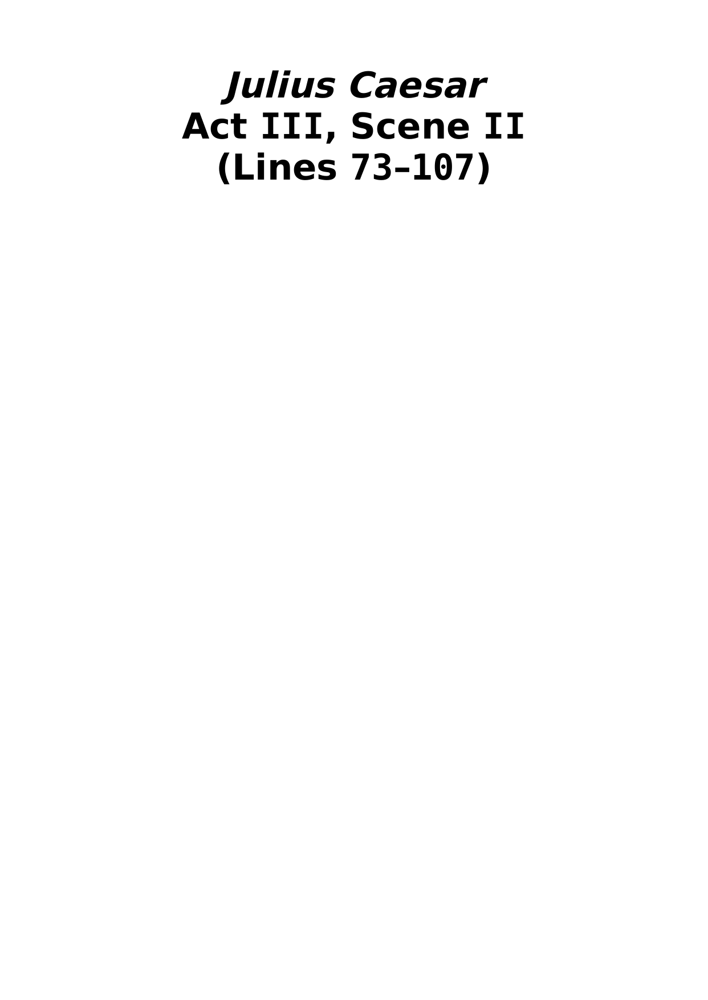
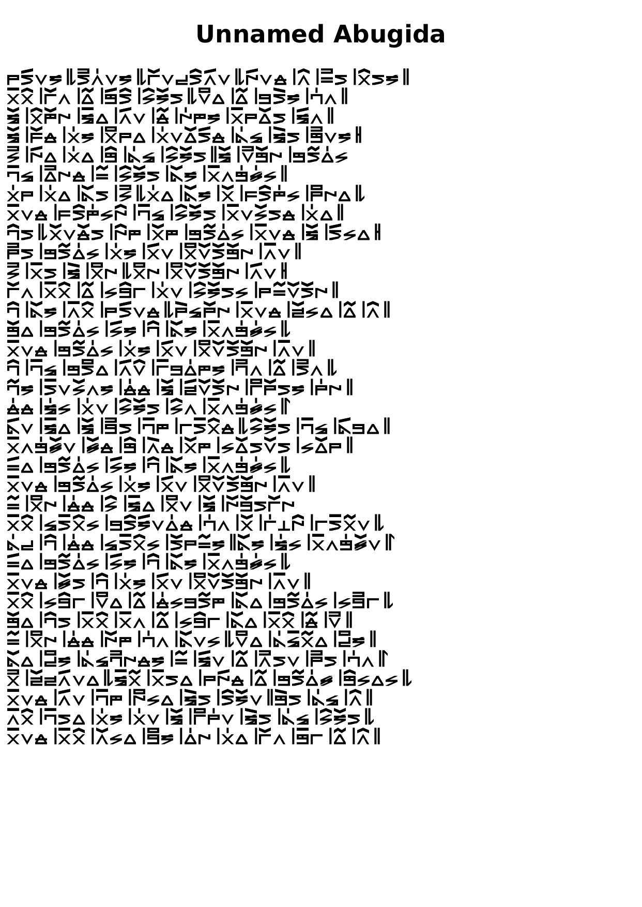
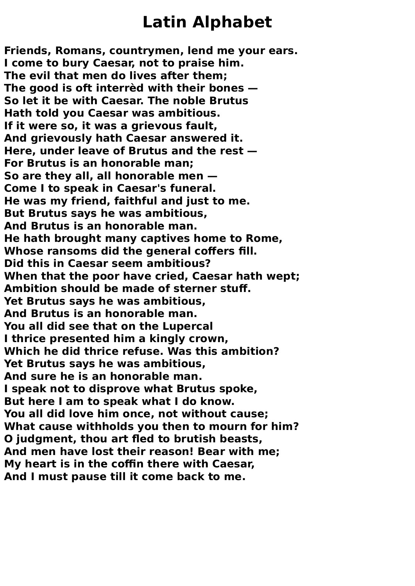

<style>
	body {
		font: 20px Verdana;
	}
</style>
<!--# Unnamed Abugida
## `IPA`

## `IVLIVS CAESAR`


-->
# Future Script Plans
1. ```
	Type: Abugida | Alphabet
	Glyph Variants:
		Solo
		& Initial?
		& Medial
		& Final?
	Direction: Down | Right => Boustrophedon?
	```