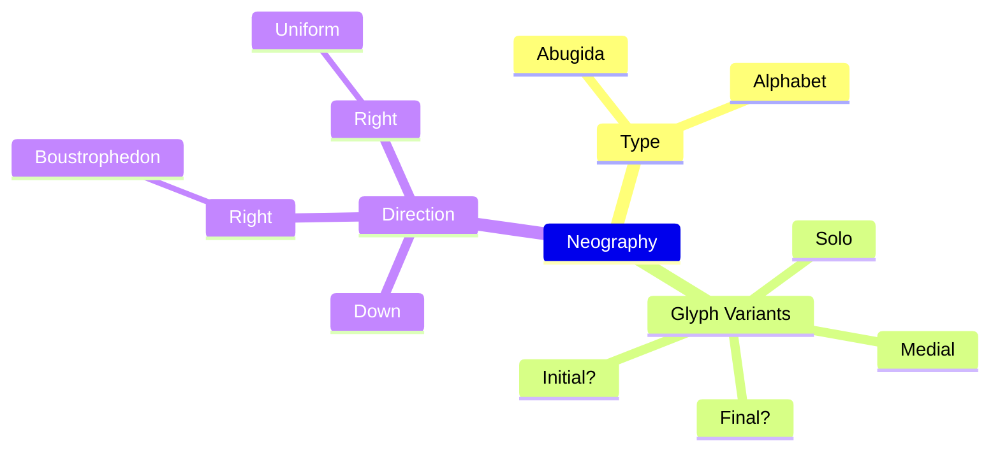

<!--
# Thoughts?
## Syntax
### Key:Value Pair
```
1 : 2
```
### OR
```
1 | 2
```
### AND
```
1 & 2
```
### IF-THEN
```
1 ? 2
```
### IF-THEN-ELSE
```
1 ? 2 > 3
```
### Alias of `1 & ( 1 ? (2 | 3) )`
```
1 => ( 2 | 3 )
```
### Optional
```
1*
```
### Grouping
```
( 1 )
```
### Inline Comments
```
//	Inline
```
### Block Comments
```
/*
	Multiline
*/
```
## Data
```
Type : (
	Abugida
	| Alphabet
)
Glyph Variants : (
	Solo
	& Initial*
	& Medial
	& Final*
)
Direction : (
	Down
	| Right => (
		Boustrophedon
		> Uniform
	)
)
```
## Options
- Type
	- Abugida
	- Alphabet
- Glyph Variants
	- Solo + Medial
	- Solo + Initial + Medial
	- Solo + Medial + Final
	- Solo + Initial + Medial + Final
- Direction
	- Down
	- Right + Boustrophedon
	- Right + Uniform
## Graph
-->

